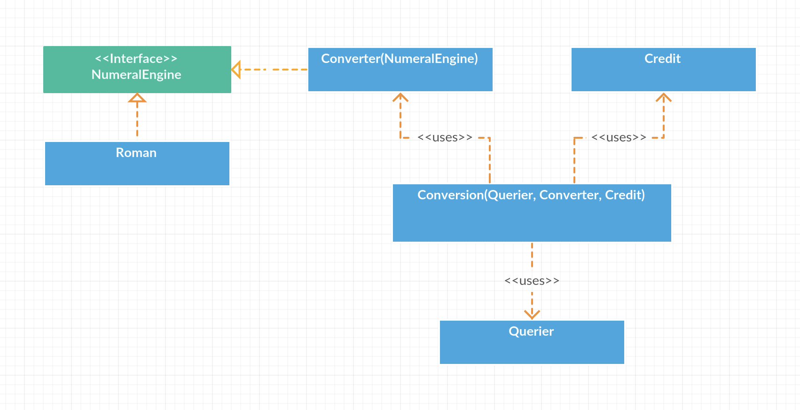

# intergalactic

Intergalactic numerals conversion

## System Design



There are 5 main objects that have their respective responsibilities, such as in one of the principles at SOLID, namely the Single Responsibility Principle. 5 of these objects namely Numeral Engine, Converter, Credit, Querier, and Conversion.

**Numeral Engine** is an interface that has the responsibility of converting number conventions to easily understandable numbers. **Roman Numerals** use contracts that are on the Numeral Engine. When there are new engines, we can make and use new engines without having to change the existing engine.

**Converter** is used to change the arrangement of foreign numbers based on units that have been previously formed. The converter depends on the Numeral Engine to convert these foreign numbers into understandable numbers. In this case the foreign number is similar to Roman numbers, so **Roman Numerals** are used as engines to convert them to numbers.

**Credit** is used to store existing types of credit to later be used as a multiplier of the numbers produced by the Converter.

**Querier** is used to extract from a given statement or input to produce parameters that can be used for other objects. Such as alias for a new unit, foreign numbers, and amount of credit.

**Conversion** is used as the main bridge for interaction between objects to produce the expected output. So that Conversion has dependence on other objects, namely Querier, Converter, and Credit.

## Requirements

* Go >= 1.10
* A built-in testing command `go test`

## Installation

Just clone this repository and make sure `go` was installed on your machine.

**Optional**

You can build some binaries based on your OS with the following command:

Linux
```bash
$ ./build-linux.sh
```

Or MacOS
```bash
$ ./build-macos.sh
```

Or Windows
```bash
$ ./build-windows.sh
```

## Testing

Run the tests with:

```bash
go test ./...
```

Or see the log all tests and the coverage of code with:

```bash
go test ./... -v -cover
```

## Running

To start using this application, you can use:

```bash
$ go run main.go
```

or you can use the `intergalactic` binary which has been built based on your OS from the build directory. Example:

```bash
$ build/macos/64/intergalactic
```

## Usage

This application is a CLI (Command Line Interface) tool, after you run this application, you can start using it.

```bash
:: Intergalactic numerals conversion ::
```

Here is the example of usage:

**Create a new unit based on symbols of Roman numerals**

You enter it one by one line
```bash
glob is I
prok is V
pish is X
tegj is L
```

**Find the credit amount based on total credits and foreign numbers**

You enter it one by one line
```bash
glob glob Silver is 34 Credits
glob prok Gold is 57800 Credits
pish pish Iron is 3910 Credits
```

**Find the number of foreign numbers**

Your input:
```bash
how much is pish tegj glob glob ?
```

Response from the program:
```bash
pish tegj glob glob is 42
```

**Find the credit total based on the number of foreign numbers**

Your input:
```bash
how many Credits is glob prok Silver ?
```

Response from the program:
```bash
glob prok Silver is 68 Credits
```

Your input:
```bash
how many Credits is glob prok Gold ?
```

Response from the program:
```bash
glob prok Gold is 57800 Credits
```

Your input:
```bash
how many Credits is glob prok Iron ?
```

Response from the program:
```bash
glob prok Iron is 782 Credits
```

**The statement is unknown, so the program can't understand what is mean**

Your input:
```bash
how much wood could a woodchuck chuck if a woodchuck could chuck wood ?
```

Response from the program:
```bash
I have no idea what you are talking about
```

To exit this application, just press `CTRL+C`.
